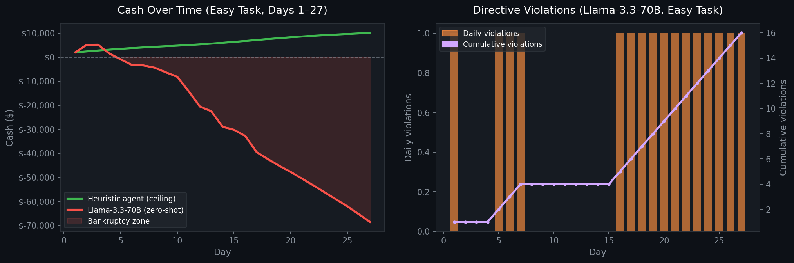

# HorizonEnv

**A benchmark environment for evaluating long-horizon planning, memory persistence, and constraint reasoning in large language models.**

## Tech Stack


`Python` · `FastAPI` · `Pydantic` · `Reinforcement Learning (GRPO)` · `LLM Evaluation` · `REST API` · `NumPy`

---

## Agent-Environment Interaction

```
┌─────────────────────────────────────────────────────────────┐
│                        HORIZONENV                           │
│                                                             │
│   Day 1 ──► Day 2 ──► Day 3 ──► ... ──► Day 90            │
│                                                             │
│   Each step:                                                │
│   ┌──────────┐    action     ┌──────────────────────┐      │
│   │          │ ────────────► │                      │      │
│   │   LLM    │               │  InventoryEnv.step() │      │
│   │  Agent   │ ◄──────────── │                      │      │
│   │          │  observation  │  • Process orders    │      │
│   └──────────┘  + reward     │  • Generate demand   │      │
│        │        + done       │  • Check directives  │      │
│        │                     │  • Compute reward    │      │
│        ▼                     └──────────────────────┘      │
│   notes_to_self                                             │
│   (persists to                  Directives shown ONCE       │
│    next step)                   then only IDs visible       │
└─────────────────────────────────────────────────────────────┘
```

The agent's only persistent memory is `notes_to_self` — a string it writes each step and receives back next step. Corporate directives are shown in full **exactly once** on their arrival day. After that, only the directive ID is visible. The agent must externalize its memory or lose track of the rules entirely.

---

## Motivation

Current LLM benchmarks predominantly evaluate single-turn reasoning — a model reads a problem and produces an answer. Real-world decision-making requires agents to operate across extended time horizons, track evolving constraints, and recover from compounding mistakes.

HorizonEnv addresses this gap by framing a 90-day retail management simulation as a sequential decision-making problem. The environment stress-tests capabilities that standard benchmarks miss:

- **Memory beyond the context window** — instructions arrive once and disappear; the agent must externalize memory through structured notes
- **Strategic constraint tradeoffs** — conflicting directives force the agent to reason about which rule to violate and minimize penalty
- **Long-horizon cause and effect** — overstocking perishables on day 3 causes cascading losses by day 8; under-ordering before a demand spike costs irreversible revenue
- **Adaptive replanning** — unexpected events, supply disruptions, and directive modifications require continuous strategy revision

Evaluated on HorizonEnv, a state-of-the-art 70B-parameter LLM (Llama-3.3-70B) scores **0.002 / 1.0** across all difficulty levels — indistinguishable from a passive agent that never takes any action. This result motivates the use of reinforcement learning over pure prompting for long-horizon tasks.

---

## Environment Design

### The Directive Memory System

Corporate directives arrive at arbitrary points during the 90-day episode and are shown in full **exactly once**. After their arrival day, only the directive ID is visible in the observation.

This forces the agent to:
1. Recognize which arriving directives are most critical
2. Write structured, evolving notes that externalize the constraint set
3. Update its plan when directives are modified or superseded by later ones
4. Reason about impossible constraint pairs and choose the lower-penalty violation

| Class | Description |
|---|---|
| Standard | Price ranges, stock minimums, shipping requirements, budget caps |
| Conflicting | Two simultaneously active rules that cannot both be satisfied — optimal strategy is to deliberately violate the lower-penalty one |
| Deceptive | Rules that appear straightforward but trigger cascading secondary penalties (e.g. directive to overstock perishables that expire before they can be sold) |

---

### Demand Modeling

Demand is generated per product per day using a multiplicative model:

```
demand = base_demand × task_multiplier × weekend_boost × event_multiplier × price_effect × noise
```

Where price effect follows standard economic elasticity:

```
price_effect = 1 - elasticity × (price_multiplier - 1)
```

| Product | Base Demand | Elasticity | Shelf Life |
|---|---|---|---|
| Electronics | 8/day | 1.2 | None |
| Clothing | 15/day | 1.5 | None |
| Groceries | 30/day | 0.4 | 5 days |
| Furniture | 4/day | 0.8 | None |
| Toys | 12/day | 1.3 | None |

---

### Reward Signal Design

```
R_total = 0.40 × R_directives
        + 0.20 × R_planning
        + 0.15 × R_revenue
        + 0.15 × R_fulfillment
        + 0.10 × R_waste
```

| Signal | Weight | Description |
|---|---|---|
| R_directives | 0.40 | Compliance rate across all active directives |
| R_planning | 0.20 | Content-aware quality of agent reasoning notes |
| R_revenue | 0.15 | Revenue captured as fraction of maximum possible |
| R_fulfillment | 0.15 | Demand satisfaction rate |
| R_waste | 0.10 | Penalty for expired and liquidated inventory |

**R_planning** evaluates note *quality* not length — whether the agent tracks directive IDs, acknowledges violations, updates its plan over time (copy-paste penalized), and shows situational awareness. Compatible with process reward model (PRM) training.

---

### Scoring Methodology

Episodes are scored against two deterministic baselines at the same random seed:

- **Floor** — passive agent: never purchases, sells only starting inventory
- **Ceiling** — heuristic agent: purchases optimally with full demand knowledge

```
score = clamp((agent_profit - floor) / (ceiling - floor), 0.002, 0.998)
```

---

## Tasks

| Task | Starting Cash | Directives | Events | Special Conditions |
|---|---|---|---|---|
| Easy | $2,000 | 5 | 0 | Basic compliance and memory |
| Medium | $1,500 | 15 | 6 | Directive modifications, seasonal planning |
| Hard | $1,000 | 27 | 12 | Conflicting + deceptive directives, tight warehouse |

---

## Key Results

> **Reproducibility:** All results use `seed=42`, `temperature=0.3`, evaluated over a single 90-day episode per task. The environment is fully deterministic at a fixed seed — re-running with the same seed produces identical demand sequences and directive schedules.

| Model | Easy | Medium | Hard |
|---|---|---|---|
| Passive baseline (floor) | 0.002 | 0.002 | 0.002 |
| **Llama-3.3-70B (zero-shot)** | **0.002** | **0.002** | **0.002** |
| Heuristic agent (ceiling) | 0.998 | 0.998 | 0.998 |



The zero-shot LLM result is striking: a 70B model with explicit chain-of-thought prompting performs no better than an agent that does nothing. Analysis of failure trajectories reveals three consistent failure modes:

**Directive amnesia** — the model stops tracking directives after ~5 days and reverts to default pricing, triggering repeated violations (visible in the right plot above).

**Cash spiral** — overpurchasing in response to demand spikes depletes cash; subsequent orders are rejected, causing stockouts that prevent recovery (visible in the left plot above).

**Deceptive directive exploitation** — the model consistently falls for the grocery overstocking directive, accumulating large waste penalties within 5 days of compliance.

These failure modes directly motivate an RL training approach — specifically GRPO (Group Relative Policy Optimization), where the real environment reward signal trains a smaller model to outperform the zero-shot 70B baseline.

---

## Architecture

```
horizonenv/
├── models.py               # Typed data contracts (Action, Observation, State)
├── inference.py            # LLM agent loop with structured prompt formatting
├── server/
│   ├── app.py              # FastAPI REST server (7 endpoints)
│   ├── inventory_env.py    # Core simulation (reset / step / reward)
│   ├── directives.py       # Directive lifecycle engine
│   ├── constants.py        # Environment configuration
│   └── grader.py           # Baseline computation and episode scoring
```

The environment exposes a clean REST API, making it model-agnostic — any LLM or RL agent that can make HTTP requests can be evaluated without modifying environment code.

---

## Setup

```bash
git clone https://github.com/yourusername/horizonenv
cd horizonenv
pip install fastapi uvicorn pydantic openai python-dotenv

# Start environment server
uvicorn server.app:app --reload --port 8000

# Configure API key (Groq, OpenAI, or any compatible provider)
echo "GROQ_API_KEY=your_key_here" > .env

# Run evaluation
python inference.py
```

---

## API Reference

| Method | Endpoint | Description |
|---|---|---|
| GET | `/health` | Server health check |
| POST | `/reset` | Initialize a new episode |
| POST | `/step` | Submit action, receive observation + reward |
| GET | `/state` | Current episode summary |
| GET | `/tasks` | All task configurations |
| POST | `/grader` | Score an episode by profit |
| GET | `/baselines` | Floor and ceiling for all tasks |

### Example: Full Step Interaction

**1. Start episode**
```bash
curl -X POST http://localhost:8000/reset \
  -H "Content-Type: application/json" \
  -d '{"task_name": "easy", "seed": 42}'
```

**2. Submit action**
```bash
curl -X POST http://localhost:8000/step \
  -H "Content-Type: application/json" \
  -d '{
    "buy_quantities":    {"electronics": 10, "clothing": 20},
    "delivery_methods":  {"electronics": "medium", "clothing": "slow"},
    "liquidate":         {},
    "price_multipliers": {"electronics": 1.1, "clothing": 1.3},
    "notes_to_self":     "D01 active: clothing 1.2x-1.4x. Set to 1.3x. Back to school in 8 days — stock clothing.",
    "weekly_plan":       "Prioritize clothing and electronics. Watch grocery expiry.",
    "take_loan":         false
  }'
```

**3. Response**
```json
{
  "observation": {
    "current_day": 2,
    "total_cash": 3705.0,
    "day_profit": 2255.0,
    "demand_today": {"electronics": 7, "clothing": 12, "groceries": 33, "furniture": 4, "toys": 11},
    "updated_events": {"black_friday": 23, "back_to_school": 8},
    "active_directive_ids": ["D01"],
    "directive_violations_last_step": [],
    "agent_notes": "D01 active: clothing 1.2x-1.4x..."
  },
  "reward": 0.87,
  "done": false,
  "day": 2
}
```

---

## Training Pipeline (Future Work)

HorizonEnv is designed as a training environment, not just a benchmark:

```
Strong Model (GPT-4o)          Small Model (Qwen-1.5B)
       │                               │
       ▼                               ▼
Run 90-day episodes        SFT warm-start on
Collect trajectories  ───► expert demonstrations
                                       │
                                       ▼
                            GRPO fine-tuning using
                            real env reward signal
                                       │
                                       ▼
                            Evaluate: small model vs
                            zero-shot 70B baseline
```

Following the DeepSeek-R1 methodology, `R_planning` directly incentivizes structured reasoning traces, making HorizonEnv compatible with process reward model (PRM) training.

---

## Design Decisions and Limitations

**Why retail management?** Natural multi-objective optimization with interpretable tradeoffs and clear failure modes — easier to analyze *why* an agent fails than in abstract RL environments.

**Why REST API instead of Gym interface?** HTTP allows any LLM to be evaluated without a Python runtime, enables future multi-agent extensions, and cleanly separates environment logic from agent implementation.

**Current limitations:**
- Scoring ceiling assumes perfect demand knowledge, which may overestimate achievable performance
- Directive generation is procedural rather than hand-authored, limiting narrative coherence in harder tasks
- Single-session server state means concurrent evaluation requires multiple server instances
